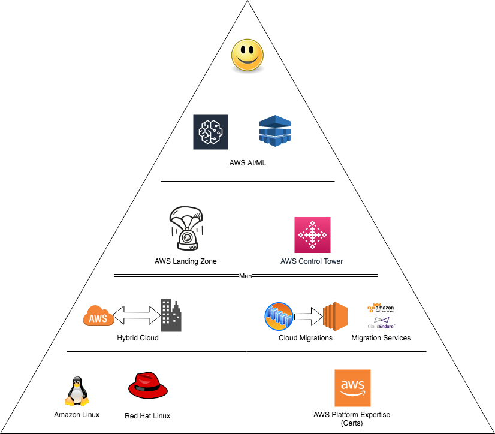

# devops - cloudXabide

## Summary  
DevOps type stuff I find useful - whatever that might mean.

The particular renaissance I happen to be traversing, involves a career transition to the cloud, from a primary focus on Infrastructure and OS Platform (i.e.  Red Hat Enterprise Linux, and Red Hat Products - OpenShift, Satellite, Ansible) ... I worked for AWS for a while and learned that I left my heart in.... Washington, D.C. and went back to Red Hat.  And now I am back at AWS, again (and having a blast).

My past: 
* Enterprise Storage (Hitachi, EMC, NetApp, Brocade, Cisco)
* Backup & Restore (Netbackup and TSM)
* Operating System (Linux, Solaris, Vmware, AIX)
* Consultant, Solutions Architect for a VAR
* Worked for Sun Microsystems, AWS, and Red Hat

I have created this repo to track my latest Renaissance.

At this point, now that I use MacOS, I miss many things about a Linux Desktop Environment.  Gnu-utils (vs the BSD equivalents) just seem easier to get things accomplished with - perhaps it is just familiarity (or "old dog, new tricks").

I try to use the following [Manifesto](Manifesto.md) to guide me.

## Goal
As this is a fairly significant change in my career, I wanted to track it for a number of reasons.  Partially because I'm not really a spring chicken and may forget stuff, but... it will be fun to look back at the genesis of all this.  
Please, if you find stuff that seems inaccurate, non-optimal... or just plain wrong, let me know.

<!-- .element height="20%" width="20%" -->

## Layout
* Directories
  * COMMANDS - place where I'll track commands and procedures for tasks  
  * Foo - Misc examples (hopefully the file name are intuitive)
  * FILES - files such as bash profile, git config, etc...  
  * Images - Store the images 
  * Scripts - a bunch of shell scripts.  
    NOTE:  [Scripts/check_git.sh](Scripts/check_git.sh) will run through all of my repos and report their status (or will pull updates).  Probably useless to most folks.

## Notes

WARNING ! WARNING ! WARNING... 
  - as with anything you find on the Interwebs, you should be cautious if you deploy anything from my Repo here.

