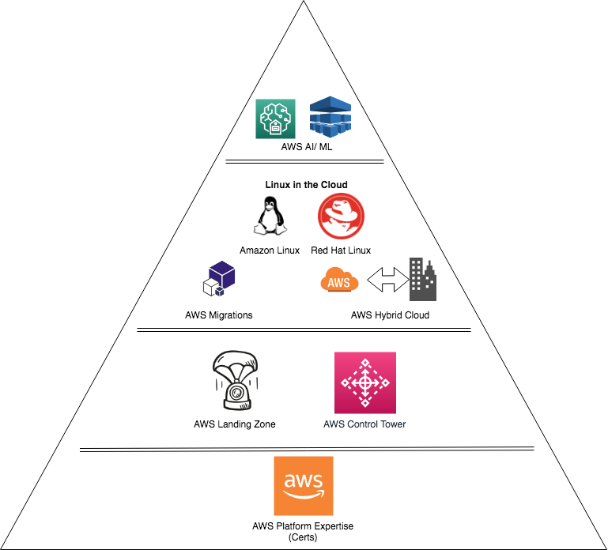

# devops - cloudXabide

## Summary  
DevOps type stuff I find useful - whatever that might mean.

The particular Renaissance I happen to be in involves a career transition to the cloud, from a primary focus on Infrastructure and OS Platform (i.e.  Red Hat Enterprise Linux, and Red Hat Products - OpenShift, Satellite, Ansible) ... while also switching to a Mac as my daily driver from a Fedora Linux laptop.  I imagine this is not a big ask for seasoned developers, but... like I mentioned, I am a "platform guy" which I have spent the entirety of my career doing.

I have created this repo to track it all.

At this point, I miss many things about a Linux Desktop Environment.  Gnu-utils just seem easier to get things accomplished with - perhaps it is just familiarity (or "old dog, new tricks").

I try to use the [Manifest.md](Manifesto.md) to guide me.

## Goal
As this is a fairly significant change in my career, I wanted to track it for a number of reasons.  Partially because I'm not really a spring chicken and may forget stuff, but... it will be fun to look back at the Genesis of all this.  
Please, if you find stuff that seems inaccurate, non-optimal... or just plain wrong, let me know.

<!-- .element height="20%" width="20%" -->

## Layout
* Directories
  * COMMANDS - place where I'll track commands and procedures for tasks  
  * Foo - Misc examples (hopefully the file name are intuitive)
  * FILES - files such as bash profile, git config, etc...  
  * Images - Store the images 
  * Scripts - a bunch of shell scripts.  NOTE:  I sometimes will write a script just to document something.  [Scripts/check_git_status.sh](Scripts/check_git_status.sh) for example, just keeping track of some handy git commands.

## Notes
I will self-proclaim that I am (probably) fairly old-school.  I would just as soon write a bash script, with some crazy awk/sed thing that I spent far too long researching.  But, I also want to be efficient and valuable to the people I work with/for, so... I am adopting a new strategy.

Expect this to change quite frequently, and quite significantly initially (Winter of 2018/2019).

WARNING ! WARNING ! WARNING... I'll say this again, I am just learning how to do this stuff on Mac
  - as with anything you find on the Interwebs, you should be cautious if you deploy anything from my guide here.

